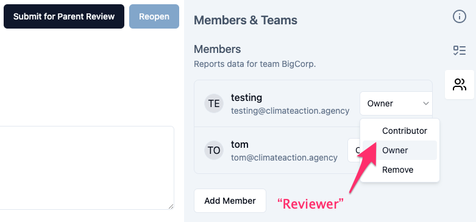

# Test app for Remix and Supabase

## Tech stack

[React](https://reactjs.org/),
[Remix](https://remix.run/),
[Supabase](https://supabase.com/),
[TypeScript](https://www.typescriptlang.org/),
[shadcn/ui](https://ui.shadcn.com/),
[Tailwind](https://tailwindcss.com/)

## Setting up

1. Clone this repo: `git clone git@github.com:Climate-Action-Agency/test-remix-supabase.git`
2. [Start Docker](https://www.docker.com/) (used for Supabase)
3. Start Supabase: `npx supabase start` (local Supabase web admin: http://localhost:54323/project/default/editor)
4. Take note of `anon key` when starting Supabase. Use `npx supabase status` if you didn’t get this already
5. Copy `.env.example` to `.env` and update `SUPABASE_ANON_KEY` from step 4
6. Reset the database: `npx supabase db reset`
7. Install NPM packages: `npm install`

## Running

Run the app with:

    npm run dev

Go to http://localhost:3000/ and log in with:

- Email: `testing@climateaction.agency`
- Password: `henricmalmberg`

## Development workflow

We normally use [Linear](https://linear.app/) for issue tracking and creating branch names, but ignore this for now.

1. Create new branch for the new feature/fix: `[username]/[description-of-feature]` (PR title: “Description of feature”).
2. Write your amazing code.
2. Apply code linting/prettifier – `npm run fix` (or `npm run precommit` if you modified the database) – before committing code and correct any issues.
3. Create a new [pull request (PR)](https://github.com/Climate-Action-Agency/test-remix-supabase/pulls) on GitHub.
4. Tech Lead will review your pull request.

P.S. It’s ok to merge `main` branch into your own feature branch to solve conflicts.

### Creating migrations for database changes

Create empty, time-stamped migration file with:

    npx supabase migration new [migration-name]

After migration:

1. Test migrations and seeding with `npx supabase db reset`
2. Update the TypeScript types from Supabase/Postgres tables with `npm run gentypes`

### Code style guide

- Aim for 1) readability, then 2) minimalism/DRY:ness: _“Code is read more than it is written”_.
- Create functions that take an _object as argument_ instead of multiple arguments where possible. Prefer `function foo({ arg1, arg2 })` over `function foo(arg1, arg2)`.
- Use `React.FC` for components.
- Use a TypeScript `interface` called `...Props` for complex function arguments, e.g: `const CategoryCard: React.FC<CategoryCardProps>`
- Event handlers starts with `handle`, props with `on`: `onPress={handlePressButton}`.
- Organise your `import`s in groups: external imports, business logic, components, assets.
- Define global TypeScript types including “shortcuts” to Supabase types in `global.d.ts`.

### How to build a typical CRUD view in Remix

- Make a Supabase/Postgres SQL view with all columns you need, e.g. `view_emission_factors`
- Create a file for your page/route (e.g. `app/routes/my-page.tsx`) with this structure:
  1.  Load data: `loader` (Remix)
  2.  Render: `export default function MyPageName` (React component). You can use `DataTable` to render the list view.
  3.  Interactions: `action` (Remix): just returns `genericCrudActions(…)` if just standard CRUD behavior is required.

## Test tasks

### Test task 1: “Reviewer” status

Go to http://localhost:3000/bigcorp/overview/2025/esrs/e1/e1-2/members

Currently we have statuses Owner and Contributor (`member` in database). We now need a third status: _Reviewer_.

This will require changes to both database and UI.

Submit your code as a [PR](#development-workflow). Good luck!